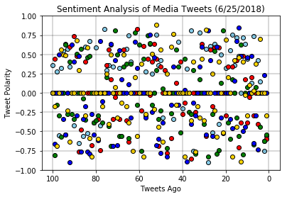
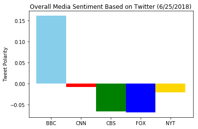

```python
# imports
import pandas as pd
import numpy as np
import matplotlib.pyplot as plt
import tweepy
import time
import json
import os
from pprint import pprint
import random
from twitter_config import consumer_key, consumer_key_secret, access_token, access_token_secret
import datetime

now = datetime.datetime.now()
nowDay = f"({now.month}/{now.day}/{now.year})"

from vaderSentiment.vaderSentiment import SentimentIntensityAnalyzer
analyzer = SentimentIntensityAnalyzer()

auth = tweepy.OAuthHandler(consumer_key, consumer_key_secret)
auth.set_access_token(access_token, access_token_secret)
api = tweepy.API(auth, parser=tweepy.parsers.JSONParser())
```


```python
def sentiment_analysis(target_user):

    # Create a counter for viewing every 100 tweets
    counter = 0

    # Loop through 100 tweets
    tweetsPer = 100
    pages = int(tweetsPer / 20)
    for x in range(1, pages+1):

        # Get all tweets from target user
        public_tweets = api.user_timeline(target_user, page=x)

        # Loop through all tweets
        for tweet in public_tweets:
            text = tweet['text']
            
            # Store all tweet times into the array
            results = analyzer.polarity_scores(text)
            tweet_times.append(tweet["created_at"])
            tweet_texts.append(text)
            tweet_pos.append(results['pos'])
            tweet_neg.append(results['neg'])
            tweet_neu.append(results['neu'])
            tweet_com.append(results['compound'])
            target_list.append(target_user)
            
            

            counter += 1

            # Print tweets for preview
            if counter % 100 == 0:
                print(tweet["created_at"])
    
    

```


```python
    # Create array to record all date-times of tweets

newsOutlets = ['BBC', 'CBSNews', 'CNN', 'FoxNews', 'NYTimes']    

    
    tweet_times = []
    tweet_texts = []
    tweet_pos = []
    tweet_neg = []
    tweet_neu = []
    tweet_com= []
    target_list= []

    count = 0
    
for channel in newsOutlets:
        count = count+1
        sentiment_analysis(channel)


```

    Tue Jun 19 13:38:02 +0000 2018
    Mon Jun 25 09:48:04 +0000 2018
    Mon Jun 25 10:55:12 +0000 2018
    Mon Jun 25 16:43:09 +0000 2018
    Mon Jun 25 09:16:03 +0000 2018
    


```python
# Length of Lists
print(f'Tweets = {len(tweet_texts)}')
print(f'Times = {len(tweet_times)}')
print(f'Compound = {len(tweet_com)}')
print(f'Positive = {len(tweet_pos)}')
print(f'Negative = {len(tweet_neg)}')
print(f'Neutral = {len(tweet_neu)}')
```

    Tweets = 500
    Times = 500
    Compound = 500
    Positive = 500
    Negative = 500
    Neutral = 500
    


```python
# Organize lists into dataframe
tweetDF = pd.DataFrame({
    'Tweet' : tweet_texts,
    'Date' : tweet_times,
    'Compound' : tweet_com,
    'Positive' : tweet_pos,
    'Negitive' : tweet_neg,
    'Neutral' : tweet_neu,
    'Outlet': target_list    
})


tweetDF.head(5)

```


<div>
<style scoped>
    .dataframe tbody tr th:only-of-type {
        vertical-align: middle;
    }

    .dataframe tbody tr th {
        vertical-align: top;
    }

    .dataframe thead th {
        text-align: right;
    }
</style>
<table border="1" class="dataframe">
  <thead>
    <tr style="text-align: right;">
      <th></th>
      <th>Compound</th>
      <th>Date</th>
      <th>Negitive</th>
      <th>Neutral</th>
      <th>Outlet</th>
      <th>Positive</th>
      <th>Tweet</th>
    </tr>
  </thead>
  <tbody>
    <tr>
      <th>0</th>
      <td>0.3612</td>
      <td>Mon Jun 25 18:03:04 +0000 2018</td>
      <td>0.000</td>
      <td>0.815</td>
      <td>BBC</td>
      <td>0.185</td>
      <td>✨ These women are ditching their straighteners...</td>
    </tr>
    <tr>
      <th>1</th>
      <td>0.0000</td>
      <td>Mon Jun 25 17:31:08 +0000 2018</td>
      <td>0.000</td>
      <td>1.000</td>
      <td>BBC</td>
      <td>0.000</td>
      <td>Two teams of junior doctors from teaching hosp...</td>
    </tr>
    <tr>
      <th>2</th>
      <td>0.2732</td>
      <td>Mon Jun 25 16:02:03 +0000 2018</td>
      <td>0.000</td>
      <td>0.769</td>
      <td>BBC</td>
      <td>0.231</td>
      <td>🙌😂 Well, that escalated quickly.\n#HearHer #Li...</td>
    </tr>
    <tr>
      <th>3</th>
      <td>-0.5524</td>
      <td>Mon Jun 25 15:01:34 +0000 2018</td>
      <td>0.229</td>
      <td>0.771</td>
      <td>BBC</td>
      <td>0.000</td>
      <td>RT @BBCTwo: SO much tension between Louis and ...</td>
    </tr>
    <tr>
      <th>4</th>
      <td>0.3182</td>
      <td>Mon Jun 25 14:57:32 +0000 2018</td>
      <td>0.000</td>
      <td>0.839</td>
      <td>BBC</td>
      <td>0.161</td>
      <td>RT @BBCTwo: brb just gonna pop inside for some...</td>
    </tr>
  </tbody>
</table>
</div>


```python
# Save Dateframe as CSV
file_name = os.path.join('CSV_output', 'Tweet_CSV.csv')
tweetDF.to_csv(file_name, sep='\t', encoding='utf-8')


```


```python
# Scatter Plot
# Filter columns to data we want for scatter plot
redDF = tweetDF.filter(items = ['Date', 'Compound', 'Outlet'])
redDF.head()

# df.loc[df['column_name'] == some_value]

# Filter rows to create a DF for each newsOutlet
BBC_DF = redDF.loc[tweetDF['Outlet'] == 'BBC']
CNN_DF = redDF.loc[tweetDF['Outlet'] == 'CNN']
CBS_DF = redDF.loc[tweetDF['Outlet'] == 'CBSNews']
FOX_DF = redDF.loc[tweetDF['Outlet'] == 'FoxNews']
NYT_DF = redDF.loc[tweetDF['Outlet'] == 'NYTimes']


# x values for scatter
x = np.arange(100, 0,-1)

# for y in ysets:
#     plt.scatter(x, y, color=next(colors))
plt.scatter(x, BBC_DF['Compound'], c = 'skyblue', edgecolors = 'black')
plt.scatter(x, CNN_DF['Compound'], c = 'red', edgecolors = 'black')
plt.scatter(x, CBS_DF['Compound'], c = 'green', edgecolors = 'black')
plt.scatter(x, FOX_DF['Compound'], c = 'blue', edgecolors = 'black')
plt.scatter(x, NYT_DF['Compound'], c = 'gold', edgecolors = 'black')

plt.title(f"Sentiment Analysis of Media Tweets {nowDay}")
plt.xlabel("Tweets Ago")
plt.ylabel("Tweet Polarity")

xmin = -5
xlim = 105
ymin = -1
ylim = 1
plt.xlim(xlim,xmin)
plt.ylim(ymin,ylim)

horLines = np.arange(ymin,ylim+.25, .25)
verLines = np.arange(xlim-5,xmin, -20)
plt.hlines(horLines, xmin, xlim, alpha=0.2)
plt.vlines(verLines, ymin, ylim, alpha=0.2)


outputfile = os.path.join('Images', 'Scatter.png')
plt.savefig(outputfile)
```





```python
# Bar Plot

BBC_mean = BBC_DF['Compound'].mean()
CNN_mean = CNN_DF['Compound'].mean()
CBS_mean = CBS_DF['Compound'].mean()
FOX_mean = FOX_DF['Compound'].mean()
NYT_mean = NYT_DF['Compound'].mean()

scoreDict = {
    'BBC': BBC_mean,
    'CNN': CNN_mean,
    'CBS': CBS_mean,
    'FOX': FOX_mean,
    'NYT': NYT_mean
}

colors = ['skyblue', 'red', 'green', 'blue', 'gold']

fig = plt.bar(range(len(scoreDict)), list(scoreDict.values()), align='center', color = colors, width =1)
fig = plt.xticks(range(len(scoreDict)), list(scoreDict.keys()))

fig = plt.title(f"Overall Media Sentiment Based on Twitter {nowDay}")
fig = plt.ylabel("Tweet Polarity")

outputfile = os.path.join('Images', 'Bar.png')
plt.savefig(outputfile)


```




